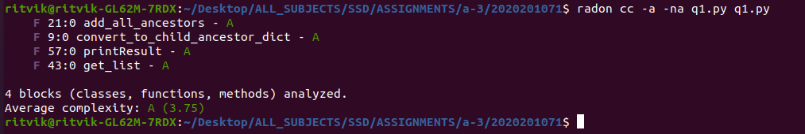
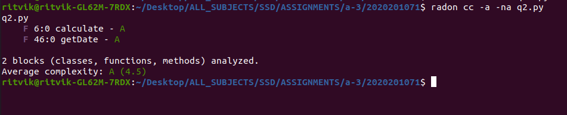
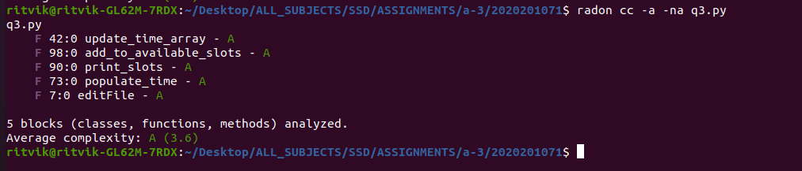

# Assignment - 3(Part C): Python
### Software Systems Development
#### Github Repo link : https://github.com/ritvik-garg/SSD-assignment-3a/tree/PartC
##### Question 1:
###### Assumptions : 
+ Code takes single line input contaning space-seperated words.
+ `Input names should exist in the org.json file`. Names which are not mentioned in the json file will throw error.
+ Input element `cannot be root elements name (level-0)`, as the parent of root element is not defined.
###### Explanation :
To find the common leader, a dictionary is created with `key as child` and `value as the list of all ancestors`, that child has. Here, the values in the list are stored such that `value[i+1] is parent of value[i]`, for i>=0.
```
{"child" : ["parent", "grandparent",..]}
```
Now, after getting input emp_ids, we get their corresponding list of ancestors using our new dictionary. The first common element in all the fetched list, is the common parent for all input emp_ids.
The level of the common parent from the input emp_ids can be found using the index of commmon parent in their corresponing fetched lists.
###### Code Difference :
+ NO DIFFERENCE FROM PART-B
##### Example of Input/Output :
###### Input:
```
<number_of_employees> <empid 1> <empid 2> ..... <empid n>
```
###### Output:
```
common leader: <emp id>
leader <empid> is <n> levels above employee <empid 1>
leader <empid> is <n> levels above employee <empid 2>
...
...
```
###### Cyclometic Complexity :

##### Question 2:
###### Assumptions :
+ Following format of dates are allowed :
    + 10th September, 2020
    + DD/MM/YYY
    + DD-MM-YYYY
    + DD.MM.YYYY
    + MM/DD/YYYY
    + MM-DD-YYYY
    + MM.DD.YYYY
    + 10th Sep, 2020
+ Incase of dates with upperscript with day (`e.g. 7th, 2nd, 31st`), there should not be any space between day and upperscript (`2 nd is not allowed`).
+ Incase of date format like `10th September, 2020` and `10th Sep, 2020`, `no command line argument for date-format will be given`.
###### Explanation :
For each of the two given input date, the `total number of days till the given date is calculated` considering leap years, and then finally, the difference of those is taken.
###### Code Difference :
+ NO DIFFERENCE FROM PART-B
##### Example of Input/Output :
###### Command Line Input:
```
python q2.py <date-format>
```
###### Output:
`'output.txt' file is created` with the format mentioned in the assignment-pdf
###### Cyclometic Complexity :

##### Question 3:
###### Assumptions :
+ A directory name `files` contains all `Employee.txt files`
+ Code `requires user input for slot duration`.
+ Works fine for all slots duration (such that conversion from hour to minute is a valid integer)
###### Explanation :
First, `text file is converted into json readable format`by replacing `'` with `"`, and then used json library to read the json data.  
Let the number of Employee.txt files be 'n'.
'n' list of size 480 is taken, for maintaiing `busy (or 1)` and `free (or 0)` slots in 9am to 5pm interval (8 hours * 60 minutes = 480) for each of the employee.
Using those 'n' list, available slots for each employee is taken, and also the first common available slot of size equal to slot duration given by the user.
###### Code Difference :
+ Big `populate_time()` function is broken down to 2-functions, i.e. added `update_time_array()` function to the code, which is called by populate_time() function. (Line - 42 and 73)
+ Overall number of `if-else` statements are reduced.
##### Example of Input/Output :
###### Input:
```
<slot_duration (in hours)>
```
###### Output:
`'output.txt' file is created` with the format mentioned in the assignment-pdf
###### Cyclometic Complexity :
